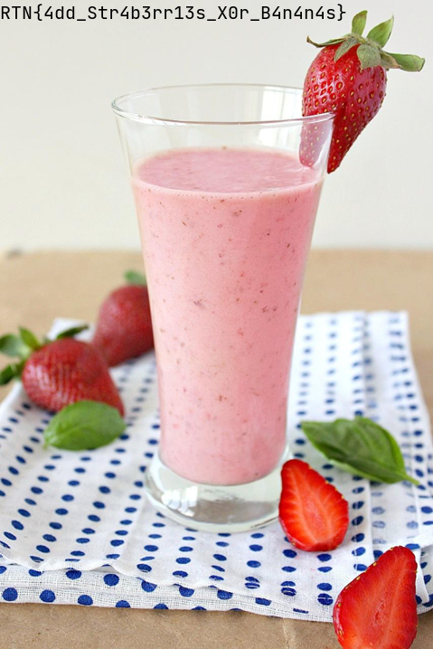

# mixitup

> We intercepted some secret pictures of which we believe contains a prototype of our competitor's newest smoothie recipe. It seems that they have mixed up more than just fruits eXclusively. Can you help us finding out what they added?

We are given two images; [image1.bmp](image1.bmp) and [image2.bmp](image2.bmp), and the challenge description hints that the original image has been **X**OR'ed with some other image containing some random data (*presumably*).

After some googling I found a tool that can do the job: `gmic`. After running `gmic image1.bmp image2.bmp -blend xor -o result.png`, we get the following image:

And just like that, we have the flag; `RTN{4dd_Str4b3rr13s_X0r_B4n4n4s}`!
