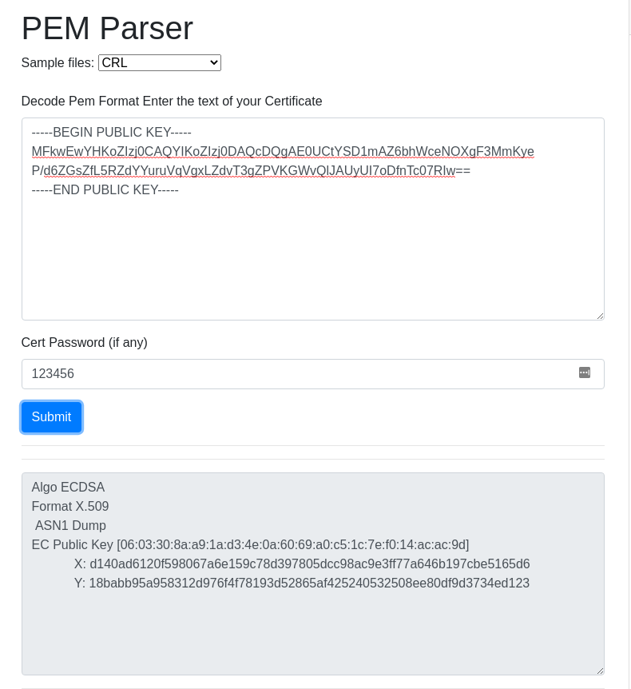

# noncense

> Dear RTN,
>
> As you might know, I am the CEO of False Fruits Ltd, and we are one of the main producers of smoothies in the country.
>
> Recently, I received a message from our IT department that our security system has problems. Two of our employees did not follow the protocol to the letter, which resulted in the formula of our latest smoothie getting leaked to the public.
>
> As one of our regulars, it is my duty to inform you about any possible security breaches in our systems. We are still investigating this incident, but since you are an expert in the field, any help is appreciated.
>
> Attached are some of the documents that resurfaced which you might find interesting.
>
> Best regards, Dr. E. Zecutive CEO of False Fruits Ltd
>
> P.S: The IT department said something about SHA 256 and public keys. Personally I have a hard time making heads and tails out of this nonsense.

Beside this message we receive a couple of PDFs and their signatures. We also get a `get_flag.sh` bash script, which downloads `flag.pdf` from a remote server and it needs a `key_file.pem`, which is the private key of `vgtables`. So it is pretty clear that our goal is to somehow recover this private key.

## Failed attempts

Last but definitely not least, we get 2 public keys. At first I thought they were RSA keys, so I tried using some common tools that try common attacks like maybe the two keys used the same `p` or `q`, but after I ran these tools, they complained that the input keys weren't in the correct format... huh?

## Starting to see the light

Let's take a closer look at what type of keys these are! After some googling I found this [nice tool](https://8gwifi.org/PemParserFunctions.jsp) that can show us what is inside these key files.



A-ha! This isn't RSA, but ECDSA! That's why the tools complained... A quick google search for `ECDSA` led me to its [Wikipedia page](https://en.wikipedia.org/wiki/Elliptic_Curve_Digital_Signature_Algorithm). What stood out immediately is that there was a section named "Concerns" under "Security". Hmmm... seems promising, let's have a look.

> In December 2010, a group calling itself fail0verflow announced recovery of the ECDSA private key used by Sony to sign software for the PlayStation 3 game console. However, this attack only worked because Sony did not properly implement the algorithm, because _**k**_ was static instead of random. As pointed out in the Signature generation algorithm section above, this makes _**d~A~**_ solvable, rendering the entire algorithm useless.

Hold up, what is _**k**_ and _**d~A~**_?

> _**d~A~**_: the private key (randomly selected)
> _**k**_: a *cryptographically secure random* integer from *[1,n-1]*.

Straight from the Wikipedia page. So... what this tells us is that if we know _**k**_ we can recover the private key _**d~A~**_.

## The solution

After some googling for `ECDSA` attack I came across [this neat little tool](https://github.com/bytemare/ecdsa-keyrec). I downloaded it, applied a few a changes so that it works for my usecase (mainly, just treat the input file as raw data instead of text). Now we need to find two messages that were sent (and signed) by `vgtables`. Opening the PDFs it seems like `document02` and `document04` were sent by them. Let's run the tool!

```bash
python3 ecdsa-nonce_reuse-crack.py -files --pubkey vgtables.pub \
  --message1 document02.pdf --signature1 document02.sig \
  --message2 document04.pdf --signature2 document04.sig \
  --hashalg sha256 --output key_file.pem
```
  
Fantastic, it worked! Now let us run the bash script that was given to us! And we get the flag in a nice PDF to keep up with the theme: `RTN{h0W_mUcH_m0r3_n0nS3ns3_d0_Y0u_w4Nt}`.

> Fun fact: Reading the PDFs from the challenge, you might notice these black bars that are used to censor some text. Well, you can actually recover the text behind them pretty easily! What's the name of the secret ingredient they are talking about in the PDFs? :eyes:
>
> *This task is trivial, so it is left as an exercise for the reader.*

No, but for real, DO IT!
