# lambdastic

> I heard you liked monads.

This was my 2nd favorite challenge out of this CTF. There may be some personal bias going on, as I am a huge fan of FP and Haskell in particular. I wouldn't say this challenge was a walk in the park, but I can't say I've struggled with it.

## What the F are monads!?

Ah yes, the age old question [no one can actually explain](https://byorgey.wordpress.com/2009/01/12/abstraction-intuition-and-the-monad-tutorial-fallacy/). I am not going to attempt it either, sorry. But no need to worry, the challenge itself isn't actually that difficult. So let's dive in!

## First impressions

Once you open the binary in `dnSpy` and head over to the `Main` method, you will see that the program expects you to input some number, then it runs through this... 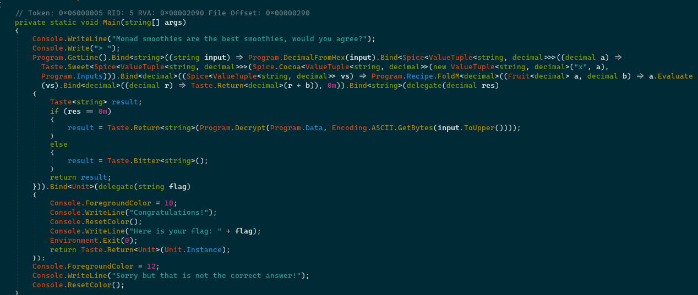 Wait wtf is this? Let's just ignore that for now and assume this is some sort of "black box". So after the input ran through that, it is used as an AES key to decrypt some data, which is probably the flag.

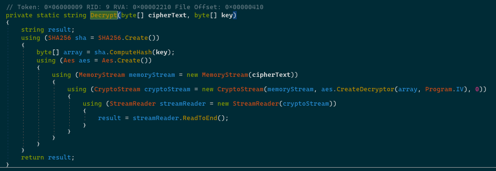

## Uncovering the mystery

Looking at the "stuff" in the `Lambdastic.Monads.*` namespaces, we can see that there 4 "categories", we are going to break them down in the order of easiest to hardest:

### Unit

There is *nothing* special about this. It is basically like `void`, except it can be used as a "value" (in other words, it can be used as an *expression*).

### Taste

- `Taste<T>`: We can see that this class is used as the return value of `Safediv`, and for me that made it instantly clear that this is the `Maybe` monad. 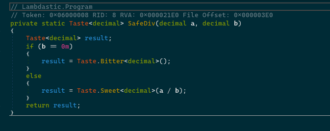 But I assume not everyone got it this quickly, so I am going to explain further. About the two methods:
  - `Bind`: In layman's terms, this basically "transforms" `Taste<X>` into some other `Taste<Y>`, using a function that takes an `X` and returns `Y`.
  - `Map`: Same thing as `Bind`, but now the "transformer" function takes `X` and returns `Taste<Y>`.
- `Bitter<T>`: Notice how this class is a singleton (private constructor and a public static property `Instance`). Meaning this class is essentially stateless. And whatever method is called on it (`Bind`/`Map`), you get the same instance back. 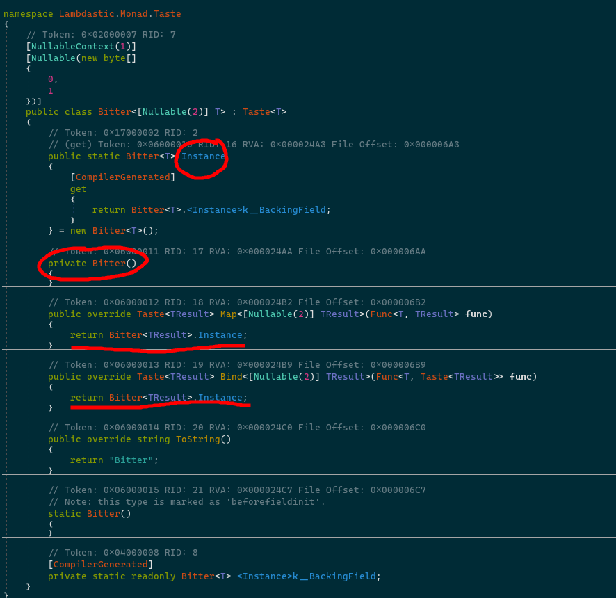
- `Sweet<T>`: In contrast to `Bitter<T>`, this is ***not*** a singleton class, it just wraps a value of type `T`. Notice how the two methods (`Bind` and `Map`) actually do something now, instead of just returning the same instance. 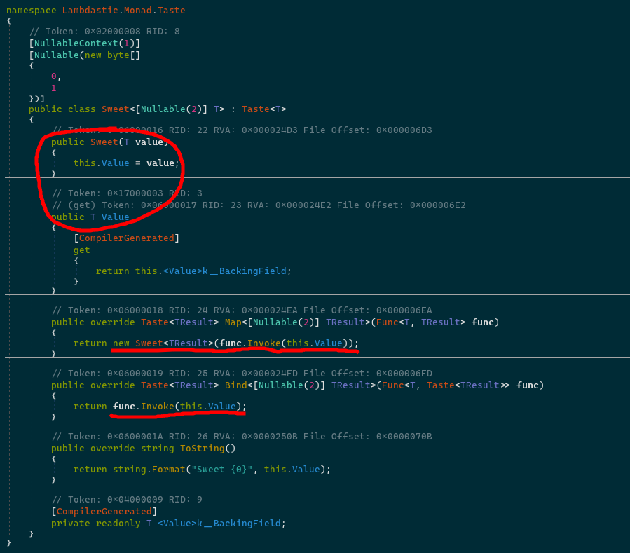
- `Taste`: This is a `static` class that provides a few helper methods, they are not really important, they just provide a few shortcuts.

### Spice

This is just a list implementation, but not an ordinary one. It is pretty much copied from Haskell, where lists are fully immutable and are "built from" heads and tails (they are more comparable to linked lists, than arrays). But again, I might have recognized this pretty quickly based on the name of the parameters of a helper method, but not everyone is familiar with FP.

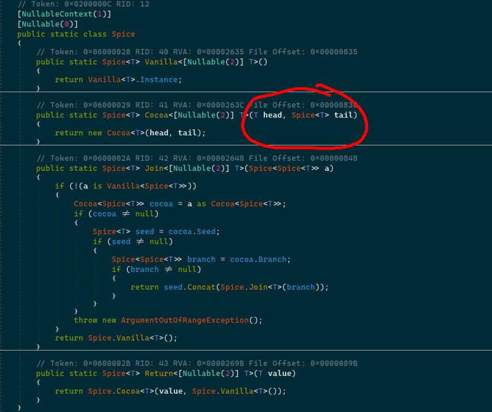

So let's break this down, shall we?

- `Spice<T>`: This is an `abstract` class for our custom list implementation. It provides a couple of methods which will be important later.
  - The `|` operator: You see, in Haskell, you usually don't index lists directly, but it is available and it looks like this: `myList !! index`

    I guess the closest match was the `|` character. We can see that this basically traverses the list, kinda like in a linked list.

    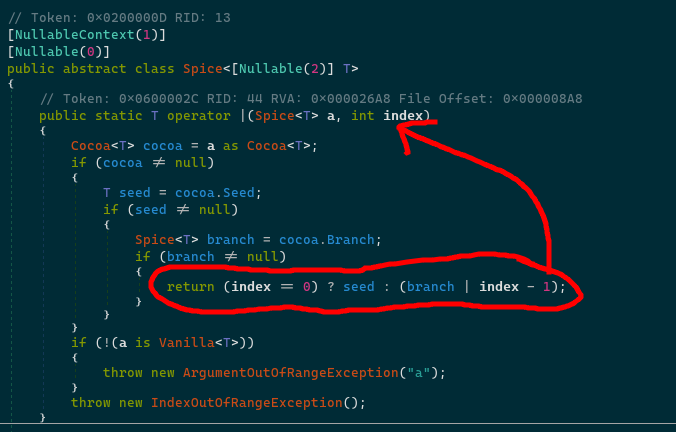

  - `Map`: Pretty much the same as `Map` from `Taste<T>`, except this will traverse the list and apply the function on every item.
  - `Bind`: Same story as with `Map`
  - `FoldM`: This is an interesting one; this is basically the same as `Aggregate` from Linq.
- `Vanilla<T>`: This is basically an empty list. How can we tell? Well... if we take a look, this is also a singleton class (private constructor and a public static property `Instance`). 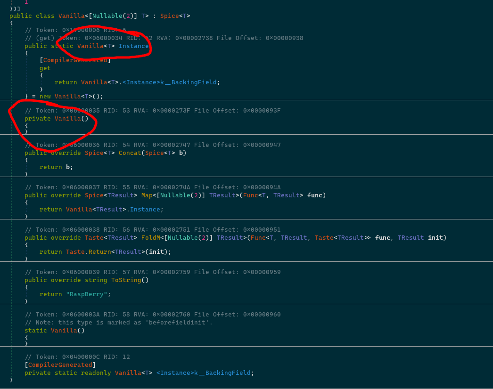
- `Cocoa<T>`: This is the "main component", this is where the heads and tails come together. 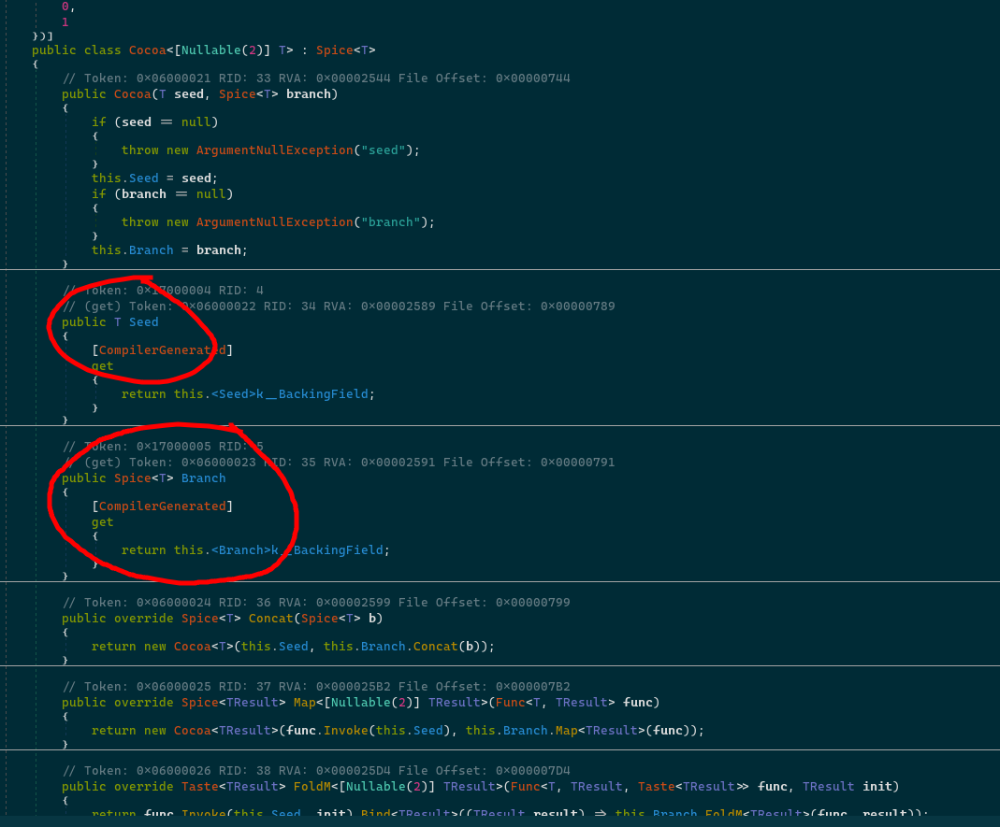
- `Spice`: Some helper methods, they aren't really important.

### Fruit

This is a bit more complex, represents expressions. There are 5 types in this namespace, so let's break it down;

- `Fruit<T>`: This is an `abstract` class which just defines an `Evaluate` method which takes in a list of "variables" in the form of a `(name, value)` tuple. 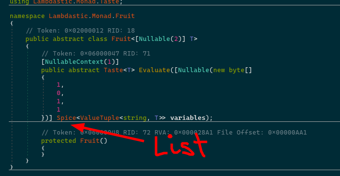
- `Apple<T>`: Just wraps a value of type `T`, think of it like a "literal" in the expression tree. 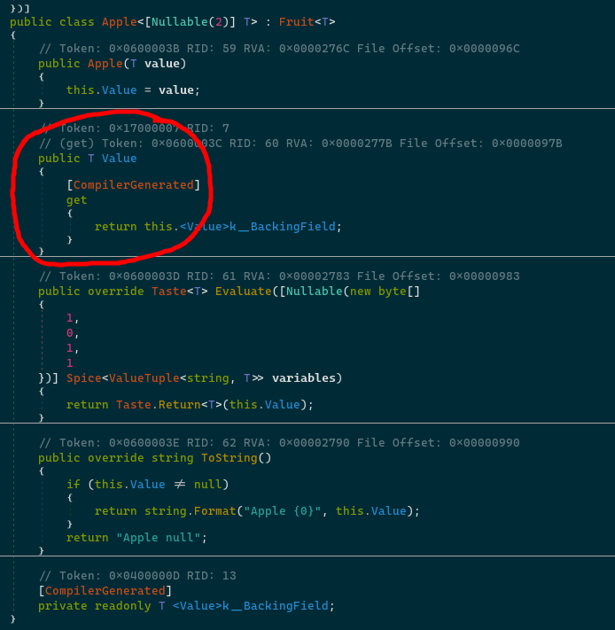
- `Banana<T>`: This is the variable expression in the expression tree. We can deduce this by looking at its `Evaluate` method implementation. 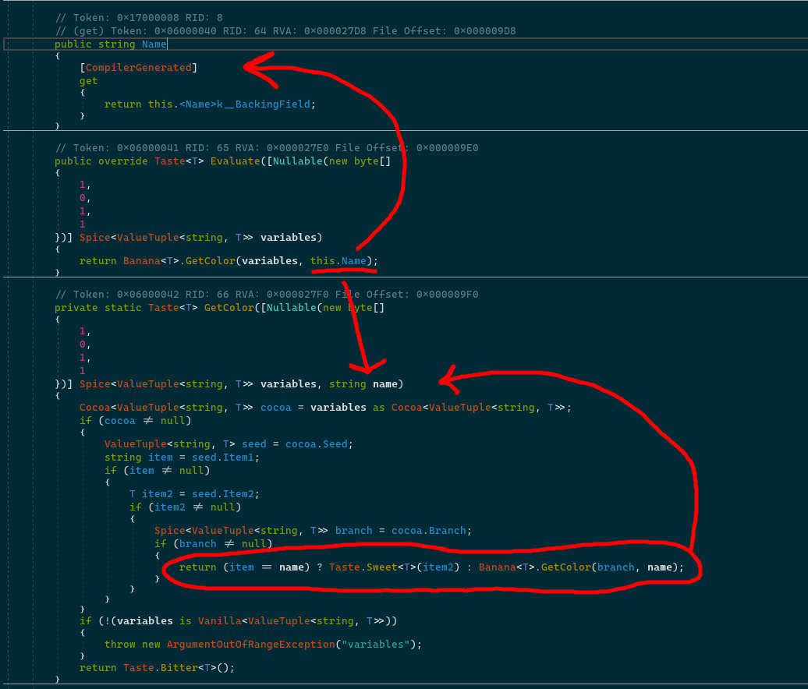 It loops over the list of variables in the evaluator and tries to find the value associated with the `Name`.
- `StrawBerry<T>`: Last, but definitely not least, we have this bad boi. This is nothing else, but a function call expression! We can see it by just inspecting the names. 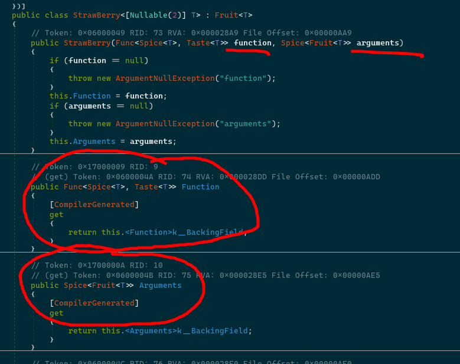 And then looking at the `Evaluate` method, we can see that it evaluates all of the `Argument`s and then calls the `Function`: 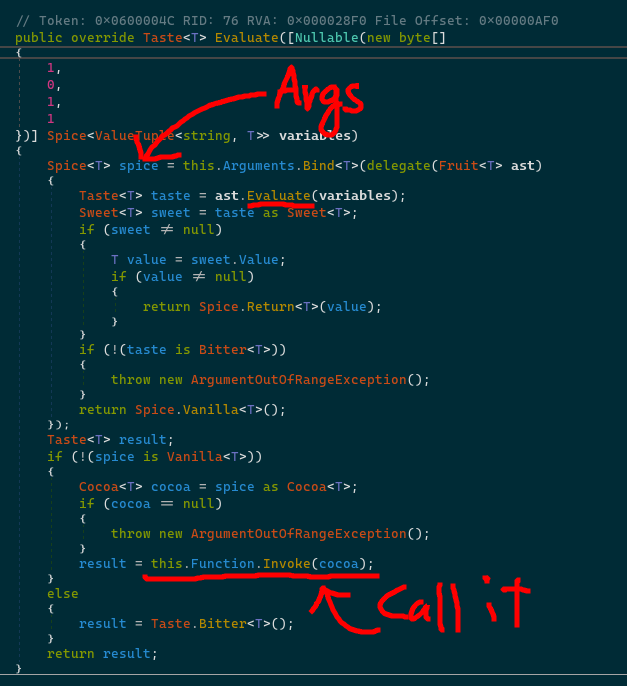

## Whew, where were we?

Ah right, let's now dissect the "black box"!
